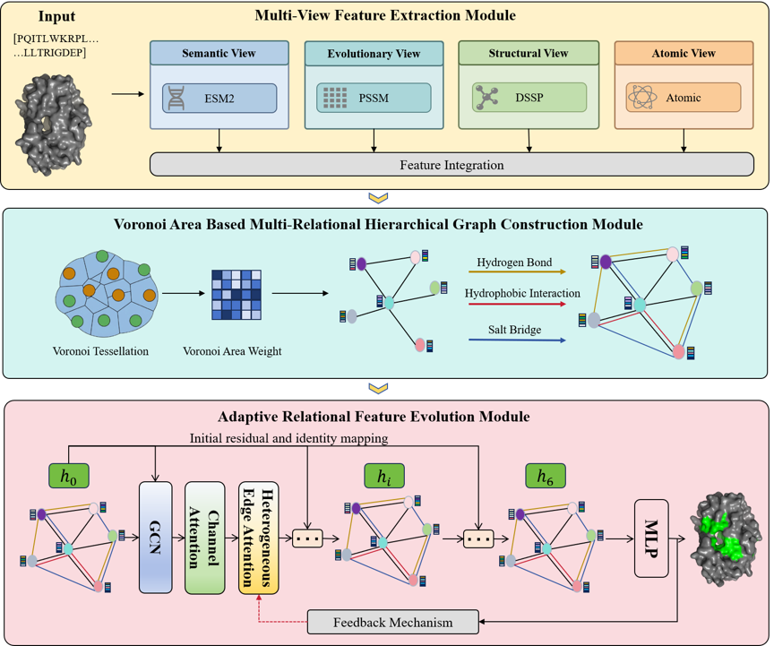
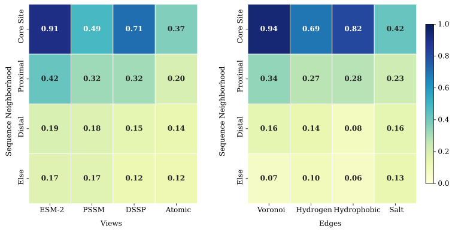
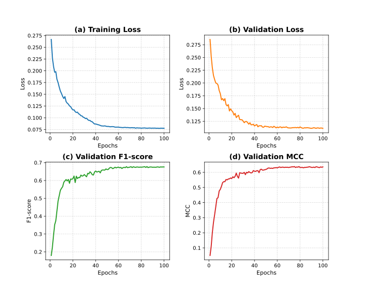

<div align="center">
  <h1>VorRel-Net: Topology-Driven Multi-Relational Learning with Voronoi Contact Area for Protein-Ligand Interaction Site Prediction</h1>
</div>

## Introduction
<p align="justify">
Accurate identification of protein–ligand binding sites constitutes a core task in computational biology and drug discovery. Existing protein graph construction methods generally define graph edges merely based on a single topological distance threshold, ignoring the complementary regulatory effects of various noncovalent interactions (such as hydrogen bonds, hydrophobic effects and long-range salt bridges) in maintaining the stability of protein three-dimensional structures and mediating specific ligand recognition. Furthermore, prevailing models suffer from feature degradation and over-smoothing issues during deep-layer stacking, alongside insufficient capacity for adaptive fusion of multimodal features. To address these bottlenecks, this paper proposes VorRel-Net (Topology-Driven Multi-Relational Learning with Voronoi Contact Area for Protein-Ligand Interaction Site Prediction), a topology-guided deep multi-relational feature fusion network. The proposed model first constructs multi-view residue representations by integrating four types of multimodal features, including sequence-based semantic embeddings from ESM-2, evolutionary information encapsulated in position-specific scoring matrix (PSSM), structural features derived from DSSP, and atomic geometric properties. A hierarchical multi-relational graph is subsequently built on the basis of Voronoi contact areas and multiple categories of noncovalent interactions. For high-order feature extraction, an Adaptive Relational Feature Evolution Module (ARFEM) is elaborately devised, which incorporates the deep graph convolutional network II (GCNII) equipped with initial residual connections and identity mapping, Channel Attention (CA), and Heterogeneous Edge Attention (HEA). This composite module enables adaptive screening and dynamic aggregation of multi-source biological features across distinct views. Additionally, a feedback mechanism is introduced to refine low-level features under the supervision of high-level semantic predictions, mitigating inherent information loss. Experimental results verify that VorRel-Net resolves dimensional mismatch and information redundancy stemming from conventional feature fusion strategies. The proposed method achieves state-of-the-art predictive accuracy and biological interpretability on the protein–ligand binding site prediction benchmark.
</p>

 

## Dependency
```markdown
python                    3.10.18
matplotlib                3.10.0
pandas                    2.3.1
torch                     2.0.0
numpy                     1.21.0
pyyaml                    6.0
scikit-learn              1.0.0
biopython                 1.79
scipy                     1.7.0
```

## Environment
<p align="justify">
We selected 6 as the number of stacked GCNII layers in VorRel-Net. After using grid search for the initial residual connection and identity mapping, α was set to 0.5, β was set to 1.3, the learning rate was 0.001, and the Adam (Adaptive Momentum) algorithm was chosen as the optimizer. To avoid overfitting, the Dropout rate was set to 0.1. The software environment includes Ubuntu 22.04, Python 3.8, Torch 2.0, and CUDA 11.8. The hardware environment includes an Intel i7 CPU (8 cores, 3.0 GHz), 96 GB of RAM, and an RTX 3090 GPU equipped with 24 GB of memory.
</p>

## Train and Test

### Train
```markdown
python train.py \--output_dir checkpoints/full_train
```

### Evaluate
```markdown
python evaluate.py \--model_path /path/to/trained_model.pth \--config configs/default.yaml \
    --output evaluation_results.txt
```
```markdown
python evaluate_vorrel.py \--eval_mode kfold \--kfold 10 \--epochs 100 \--batch_size 4 --use_focal_loss --num_workers 4 \--group_by sequence \--output_dir evaluation_results
```

## Visual Results
<div>

<p align="justify">Figure 1: Perspective of multi-view and relational attention maps.</p>
</div>

<div>

<p align="justify">Figure 2: Convergence curves of the model during the training process. (a) Training Loss, (b) Validation Loss, (c) Validation F1-score, (d) Matthews correlation coefficient (MCC).</p>
</div>